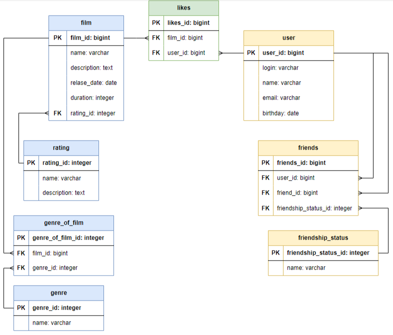

# java-filmorate

## База данных
### Схема



### Описание в текстовом формате

**`films`**  
Содержит информацию о фильмах.

Таблица включает такие поля:
- первичный ключ `film_id` - идентификатор фильма;
- `name` - название фильма;
- `description` - описание фильма;
- `release_date` - дата выпуска фильма;
- `duration` - продолжительность фильма;
- внешний ключ `rating_id` (ссылается на таблицу `rating`) - идентификатор рейтинга.

**`rating`**  
Содержит информацию о рейтинге Ассоциации кинокомпаний (МРА) фильма.

В таблицу входят поля:
- первичный ключ `rating_id` — идентификатор рейтинга;
- `name` — название рейтинга, например:
    - G
    - PG
    - PG-13
    - R
    - NC-17
- `description` - описание аббревиатуры рейтинга, например для:
    - \"G\" — \"у фильма нет возрастных ограничений\"
    - \"PG\" — \"детям рекомендуется смотреть фильм с родителями\"
    - \"PG-13\" — \"детям до 13 лет просмотр не желателен\"
    - \"R\" — \"лицам до 17 лет просматривать фильм можно только в присутствии взрослого\"
    - \"NC-17\" — \"лицам до 18 лет просмотр запрещён\"

**`genre_of_film`**  
Содержит информацию о жанре/жанрах конкретных фильмов.

В таблицу входят поля:
- первичный ключ `genre_of_film_id` — идентификатор связи фильма и жанра;
- внешний ключ `film_id` (ссылается на таблицу `film`) - идентификатор фильма;
- внешний ключ `genre_id` (ссылается на таблицу `genre`) - идентификатор жанра;

**`genr`**  
Содержит информацию о жанре фильма.

В таблицу входят поля:
- первичный ключ `genre_id` — идентификатор жанра;
- `name` — название жанра, например:
    - Комедия
    - Драма
    - Мультфильм
    - Триллер
    - Документальный
    - Боевик

**`likes`**  
Содержит информацию о \"лайках\", поставленных пользователями фильмам.

В таблицу входят поля:
- первичный ключ `likes_id` — идентификатор \"лайка\";
- внешний ключ `film_id` (ссылается на таблицу `film`) - идентификатор фильма;
- внешний ключ `user_id` (ссылается на таблицу `user`) - идентификатор пользователя;

**`user`**  
Содержит информацию о пользователях.

В таблицу входят поля:
- первичный ключ `user_id` — идентификатор рейтинга;
- `login` - логин пользователя;
- `name` - имя пользователя;
- `email` - адрес электронной почты пользователя;
- `birthday` - дата рождения пользователя.

**`friends`**  
Содержит данные о дружеских отношениях между пользователями.

В таблицу входят поля:
- первичный ключ `friends_id` — идентификатор дружеской связи;
- внешний ключ `user_id` (ссылается на таблицу `user`) - идентификатор первого пользователя;
- внешний ключ `friend_id` (ссылается на таблицу `user`) - идентификатор второго пользователя;
- внешний ключ `friendship_status_id` (ссылается на таблицу `friendship_status`) - идентификатор статуса дружеской связи.

**`friendship_status`**  
Содержит данные о возможных статусах дружеской связи.

В таблицу входят поля:
- первичный ключ `friendship_status_id` — идентификатор статуса дружеской связи;
- `name` - название дружеской связи, например:
    - confirmed
    - unconfirmed

### Примеры запросов для основных операций приложения

**Получение всех пользователей:**
```
SELECT *
FROM user;
```

**Получение пользователя по id:**
```
SELECT *
FROM user
WHERE user_id = 1;
```

**Получение всех друзей пользователя:**
```
SELECT login
FROM user
WHERE user_id IN (SELECT friend_id
                  FROM friends
                  WHERE user_id = 1
                  AND friendship_status_id = 1)
UNION
SELECT login
FROM user
WHERE user_id IN (SELECT user_id
                  FROM friends
                  WHERE friend_id = 1
                  AND friendship_status_id = 1);
```

**Получение общих друзей двух пользователей:**
```
SELECT login
FROM (SELECT login
      FROM user
      WHERE user_id IN (SELECT friend_id
                        FROM friends
                        WHERE user_id = 1
                        AND friendship_status_id = 1)
      UNION
      SELECT login
      FROM user
      WHERE user_id IN (SELECT user_id
                        FROM friends
                        WHERE friend_id = 1
                        AND friendship_status_id = 1)) AS friends_user1
  INNER JOIN (SELECT login
              FROM user
              WHERE user_id IN (SELECT friend_id
                                FROM friends
                                WHERE user_id = 2
                                AND friendship_status_id = 1)
              UNION
              SELECT login
              FROM user
              WHERE user_id IN (SELECT user_id
                                FROM friends
                                WHERE friend_id = 2
                                AND friendship_status_id = 1)) AS friends_user2 
  ON friends_user1.login = friends_user2.login;               
```

**Получение всех фильмов:**
```
SELECT *
FROM film;
```

**Получение фильма по id:**
```
SELECT *
FROM film
WHERE film_id = 1;
```

**Вывод определённого количества фильмов из рейтинга, основанного на оценках пользователей:**
```
SELECT name
FROM film
WHERE film_id IN (SELECT film_id
                  FROM likes
                  GROUP BY film_id
                  ORDER BY COUNT(user_id) DESC
                  LIMIT 10);
```
                  
=======


