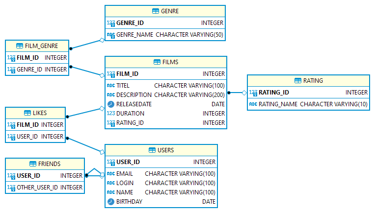

# java-filmorate
Template repository for Filmorate project.

## Entity-relationship diagram:


### Example: all users
```
SELECT *
FROM USERS;
```

### Example: all films
```
SELECT * FROM FILMS AS F
LEFT OUTER JOIN RATING AS R ON R.RATING_ID = F.RATING_ID
ORDER BY FILM_ID;
```

### Example: top 10 films
```
"SELECT F.*, R.*, COUNT(L.FILM_ID) AS all_likes
FROM FILMS AS F
LEFT JOIN RATING AS R ON R.RATING_ID = F.RATING_ID
LEFT JOIN LIKES AS L ON F.FILM_ID=L.FILM_ID
GROUP BY F.FILM_ID
ORDER BY all_likes DESC
LIMIT ?;
```

### Example: top 10 films
```
SELECT * 
FROM USERS 
WHERE USER_ID IN (SELECT OTHER_USER_ID 
                  FROM FRIENDS 
                  WHERE USER_ID=?)
AND USER_ID IN (SELECT OTHER_USER_ID 
                FROM FRIENDS 
                WHERE USER_ID=?);
```